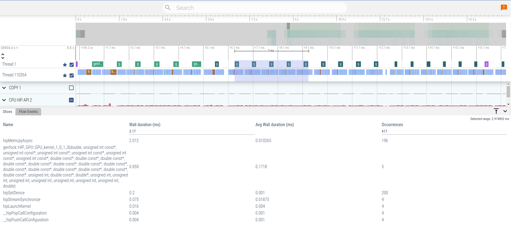

# Fluid Numerics Journal

[Back to Fluid Numerics](https://www.fluidnumerics.com)

## [Accelerating Science with GPU Software Optimization](accelerating-science-with-optimization/README.md)
{ align=left width="25%" } 
**What does it take to become a finalist for the prestigious Gordon Bell Prize?** 

For the EXESS team, it started with a focused effort to optimize their quantum chemistry application for cutting-edge GPU hardware. Discover how our Mentored Sprint service helped them achieve breakthrough performance, unlock new possibilities, and earn recognition on the world stage. [**Read more**](accelerating-science-with-optimization/README.md)

## [Maximizing Performance, Minimizing Costs: Energy Savings from GPU Optimization](saving-energy-on-quantum-chromodynamics-simulations/README.md)
{ align=left width="25%" } 
In high-performance computing, optimizing GPU workloads isn’t just about speed—it’s about unlocking hidden savings in energy and sustainability. Discover how a 1.91x performance boost turned into real cost savings and why software optimization could transform your operations. [*Read more*](saving-energy-on-quantum-chromodynamics-simulations/README.md)

## [What is a mentored sprint ?](what-is-a-mentored-sprint/README.md)
{ align=left width="25%" } 
**Imagine achieving months of software optimization progress in just one week.** 

Whether you're optimizing performance, porting to new hardware, or tackling costly inefficiencies, our Mentored Sprint service delivers fast, measurable results. Discover how teams are transforming their applications, cutting costs, and future-proofing their software with expert guidance. [*Read more*](what-is-a-mentored-sprint/README.md)

## [HIP Performance Comparisons : AMD and Nvidia GPUs](hip-performance-comparisons-amd-and-nvidia-gpus/README.md)
{ align=left width="25%" } 
If you've read some of my other posts, you're aware I'm in the midst of refactoring and updating/upgrade SELF-Fluids. On the upgrade list, I'm planning a swap-out of the CUDA-Fortran implementation for HIP-Fortran, which will allow SELF-Fluids to run on both AMD and Nvidia GPU platforms. This journal entry details a portion of the work I've been doing to understand how some of the core routines in SELF-Fluids will perform across GPU platforms with HIP. [*Read more*](hip-performance-comparisons-amd-and-nvidia-gpus/README.md)