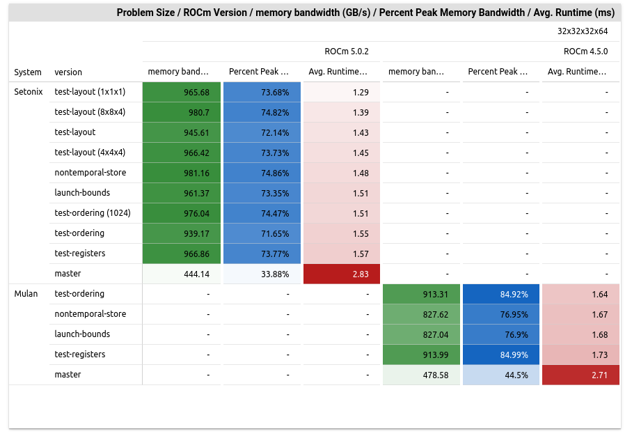

# Fluid Numerics Journal

[Back to Fluid Numerics](https://www.fluidnumerics.com)

## [Maximizing Performance, Minimizing Costs: Energy Savings from GPU Optimization](saving-energy-on-quantum-chromodynamics-simulations/README.md)
{ align=left width="25%" } 
In high-performance computing, optimizing GPU workloads isn’t just about speed—it’s about unlocking hidden savings in energy and sustainability. Discover how a 1.91x performance boost turned into real cost savings and why software optimization could transform your operations. [*Read more*](saving-energy-on-quantum-chromodynamics-simulations/README.md)

## [HIP Performance Comparisons : AMD and Nvidia GPUs](hip-performance-comparisons-amd-and-nvidia-gpus/README.md)
{ align=left width="25%" } 
If you've read some of my other posts, you're aware I'm in the midst of refactoring and updating/upgrade SELF-Fluids. On the upgrade list, I'm planning a swap-out of the CUDA-Fortran implementation for HIP-Fortran, which will allow SELF-Fluids to run on both AMD and Nvidia GPU platforms. This journal entry details a portion of the work I've been doing to understand how some of the core routines in SELF-Fluids will perform across GPU platforms with HIP. [*Read more*](hip-performance-comparisons-amd-and-nvidia-gpus/README.md)