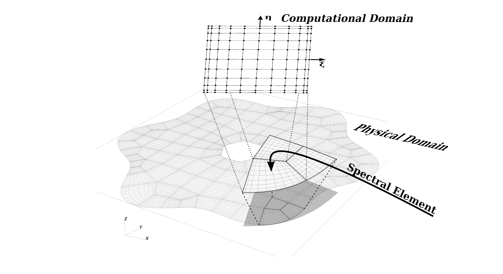

# HIP Performance Comparisons : AMD and Nvidia GPUs

## Motivation
If you've read some of my other posts, you're aware I'm in the midst of refactoring and updating/upgrade SELF-Fluids. On the upgrade list, I'm planning a swap-out of the CUDA-Fortran implementation for [HIP-Fortran](https://github.com/fluidnumerics/hip-fortran), which will allow SELF-Fluids to run on both AMD and Nvidia GPU platforms. 
This journal entry details a portion of the work I've been doing to understand how some of the core routines in SELF-Fluids will perform across GPU platforms with HIP. While this work was actually done in the Spring 2019, the results still hold today for the [HIP-Fortran](https://github.com/fluidnumerics/hip-fortran) implementation (Edit: Since writing this, AMD has taken over hip-fortran and released [HIPFort](https://github.com/ROCm/hipfort) ).

## Test Problem

{ align=center width="60%" }


For the test problem, I'm using an algorithm for the calculation of the divergence of vector function in 3-D space using a Spectral Element Collocation method. I'm choosing this as the test problem, since much of my current work is focused on a fluids solver based on a Spectral Element Method with similar computational patterns.

In spectral element methods, a physical domain is described as a mesh of quadrilaterals in 2-D or hexahedrals in 3-D. The quads and hexes are called elements. Within each element, all functions are approximated by Lagrange interpolating polynomials, whose interpolation nodes a selected as special quadrature points that provide result in spectral convergence of discretization errors. 

When a function is approximated by a polynomial interpolant, a derivative (divergence, gradient, or curl) can approximated as the derivative of the interpolant. While there are some additional calculations that are required on the edges and faces of neighboring elements to complete the method, most of the compute time for calculating a divergence is spent on so-called internal operations.

## Serial Code
In general, the internal operations associated with calculating the divergence of a 3-D vector function looks something like code-block shown below. We loop over the elements in the outer most loop, then loop over the quadrature points in the next three loop levels. Within these quadruple-nested loop, we perform a reduction that consists of 3 multiply and 3 add operations.

In this code-block, f is the 3-D vector function, df is the resulting divergence, and D is a spectral element derivative-matrix (derived from the derivative of Lagrange Interpolating Polynomials). The VEC_3D_INDEX  and 3D_INDEX are just a macros that "flatten" the multi-dimensional indices into a single index. For the problem I'm considering, there are 100 elements and N=7 (the polynomial degree of the interpolant).

```c++
for( iel=0; iel<n_elements; iel++ ){
  for( k=0; k<N; k++ ){
    for( j=0; j<N; j++ ){
      for( i=0; i<N; i++ ){
        df[SP_3D_INDEX(i,j,k,iel,N)] = 0.0;
        for( ii=0; ii<=N; ii++){
          df[3D_INDEX(i,j,k,iel,N)]=df[3D_INDEX(i,j,k,iel,N)] +                   
            D[INDEX(ii,i,N)]*f[VEC_3D_INDEX(0,ii,j,k,iel,N)] +               
            D[INDEX(ii,j,N)]*f[VEC_3D_INDEX(1,i,ii,k,iel,N)] +               
            D[INDEX(ii,k,N)]*f[VEC_3D_INDEX(2,i,j,ii,iel,N)] ;
        }
      }
    }
  }
}
```

## CUDA Kernel
When we write this kernel with CUDA, the element loop is replaced with a CUDA Block ID and the inner quadrature loops are broken out over CUDA threads within each block. Then, each CUDA thread does its own reduction in parallel.

```c++
int iel = blockidx.x;
int i   = threadidx.x;
int j   = threadidx.y;
int k   = threadidx.z;

df[SP_3D_INDEX(i,j,k,iel,N)] = 0.0;
for( ii=0; ii<=N; ii++){
  df[3D_INDEX(i,j,k,iel,N)]=df[3D_INDEX(i,j,k,iel,N)] +                   
    D[INDEX(ii,i,N)]*f[VEC_3D_INDEX(0,ii,j,k,iel,N)] +               
    D[INDEX(ii,j,N)]*f[VEC_3D_INDEX(1,i,ii,k,iel,N)] +               
    D[INDEX(ii,k,N)]*f[VEC_3D_INDEX(2,i,j,ii,iel,N)] ;
 }
 ```


## HIP-Kernel
To generate the HIP-Kernel, I simply run the hipify script that comes with the ROCm installation. For this simple set of code, no additional work is needed.

## Platforms
To compare kernel performance between AMD and Nvidia GPUs and between HIP and CUDA compilers, I'm using resources from [GPUEater](https://www.gpueater.com/) and [Google Cloud Platform](https://cloud.google.com).

GPUEater provided access to AMD Vega64 and Vega64 (Frontier Edition) GPUs. 

From Google Cloud Platform, I'm only considering the Nvidia Tesla P100 and Nvidia Tesla V100 GPUs.

A summary of the cost per hour for each GPU from when this work was done (Spring 2019) is shown below.

 <iframe width="600" height="371" seamless frameborder="0" scrolling="no" src="https://docs.google.com/spreadsheets/d/e/2PACX-1vS8InvHcVyIxSOV0gaz9M9remlhTLmK83nyfVxr9_A_qv5N4RO__nBK4NaC2Mi6kdRJi9qJci9GT05o/pubchart?oid=435211077&amp;format=interactive"></iframe>

## Results
### Run-time
For all of the runs, I execute the divergence kernel 1,000 times on a mesh with 100 elements and polynomial degree 7. In this exercise, I compare the run-times of the following Kernel-Platform combinations
* HIP Kernel + AMD Vega64 GPU
* HIP Kernel + AMD Vega64 (Frontier Edition) GPU
* HIP Kernel + Nvidia Tesla P100 GPU
* CUDA Kernel + Nvidia Tesla P100 GPU
* HIP Kernel + Nvidia Tesla V100 GPU
* CUDA Kernel + Nvidia Tesla V100 GPU

Notice that, on the Nvidia systems, the performance of the HIP and CUDA kernels are nearly identical, indicating there are no performance losses from the "hipification" process. This shouldn't be surprising, since, under the hood, the hipcc compiler will "un-hipify" HIP kernels and compile with nvcc.

Of the GPUs compared, Nvidia's V100 comes in with the lowest run-time. 

<iframe width="600" height="371" seamless frameborder="0" scrolling="no" src="https://docs.google.com/spreadsheets/d/e/2PACX-1vS8InvHcVyIxSOV0gaz9M9remlhTLmK83nyfVxr9_A_qv5N4RO__nBK4NaC2Mi6kdRJi9qJci9GT05o/pubchart?oid=415273498&amp;format=interactive"></iframe>

### Costs
With cloud computing becoming more prevalent for HPC and scientific computing, no platform comparison is complete without a cost comparison. In this case, the cost is a product of both the pricebooks of different cloud providers (GPUEater and Google Cloud Platform) and the actual runtime.

For this particular kernel, we can see that the V100 provides enough speedup over the P100 GPUs to provide an overall cost reduction in the divergence calculation. However, the AMD Vega64 GPU comes in the least expensive, even though its performance is more on-par with Nvidia's P100 GPU. 

<iframe width="600" height="371" seamless frameborder="0" scrolling="no" src="https://docs.google.com/spreadsheets/d/e/2PACX-1vS8InvHcVyIxSOV0gaz9M9remlhTLmK83nyfVxr9_A_qv5N4RO__nBK4NaC2Mi6kdRJi9qJci9GT05o/pubchart?oid=1622572652&amp;format=interactive"></iframe>


## What's next ?
With this bit of information, I'm now curious to understand why there are performance differences between the AMD and Nvidia GPUs.  Thinking about these results in the context of a Roofline performance model, the metrics to compare between the various GPUs are the memory bandwidth and floating point performance. Raw spec sheets provide some clues. 

For example, the Radeon Vega64 has a reported peak global memory bandwidth of 483.8 GB/s and peak single precision performance of 12.6 TFLOPs, while the [Nvidia Tesla V100 comes in at 900 GB/s and 14 TFLOPs](https://images.nvidia.com/content/technologies/volta/pdf/volta-v100-datasheet-update-us-1165301-r5.pdf). For the calculation we're doing, each reduction step carries out one store and seven load operations. With the reduction loop size of 8, this gives 13.1 MB of data to move for each divergence calculation. On the Nvidia V100, the achieved effective bandwidth is approximately  1.2 GB/s, suggesting we have some work to do to overcome memory bandwidth limitations. 

When just considering these two roofs and the results presented here, it is reasonable to think that the speedup on the V100 is related to its higher global memory bandwidth. Nonetheless, there are still other factors at play and a more detailed analysis of how this routine is utilizing the underlying hardware is needed.


## Related Resources:
Performance Portability Challenges for Fortran Applications

https://sc18.supercomputing.org/proceedings/workshops/workshop_files/ws_p3hpc110s2-file1.pdf